# NightKnight

[](https://apps.apple.com/us/app/nightknight-glucose-tracker/id6784815820)

Status: Early development / Alpha
Known issues: 
- Background refresh needs APNs silent push configured to be timely — see
  [docs/SILENT-PUSH.md](docs/SILENT-PUSH.md) (until then it falls back to the OS's
  best-effort `BGAppRefreshTask`)

A modern continuous-glucose-monitoring service and native iOS app, written in Rust to
run on **Cloudflare Workers + D1** *or* as a **self-hosted container + Postgres**. It
speaks the [Nightscout](https://github.com/nightscout/cgm-remote-monitor) API so the
uploaders and follower apps people already rely on keep working out of the box, and
adds a clean modern `v4` API for first-party clients.

**NightKnight is inspired by [Nightscout](https://github.com/nightscout/cgm-remote-monitor)** —
the open-source project that pioneered self-hosted CGM monitoring and has helped
countless people with diabetes and their families. NightKnight builds on the ideas and
the open API that Nightscout established; see [Acknowledgements](#acknowledgements).

> NightKnight is a personal-health project. It is **not** a medical device. Do not
> use it as the sole basis for treatment decisions.

## Screenshots

### iOS App

| Dashboard (mg/dL) | Dashboard (mmol/L) | Statistical Analysis |
|---|---|---|
| 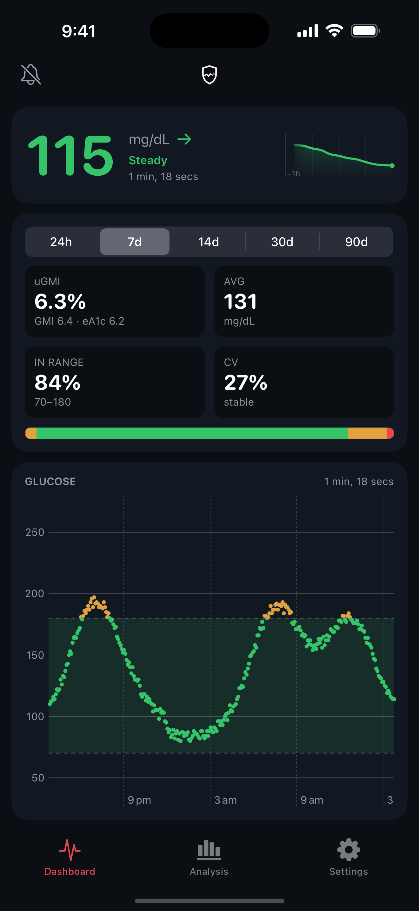 | 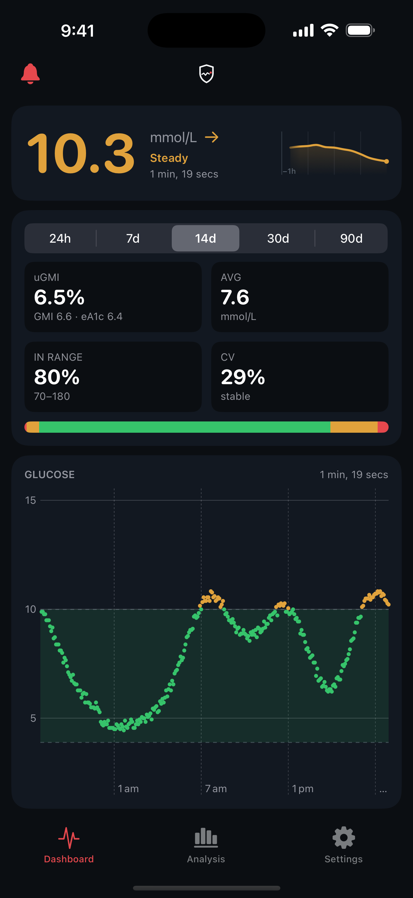 | 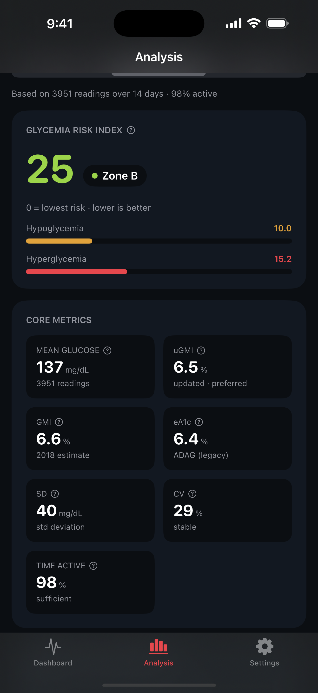 |

| AGP | Episodes & Variability | Settings |
|---|---|---|
| 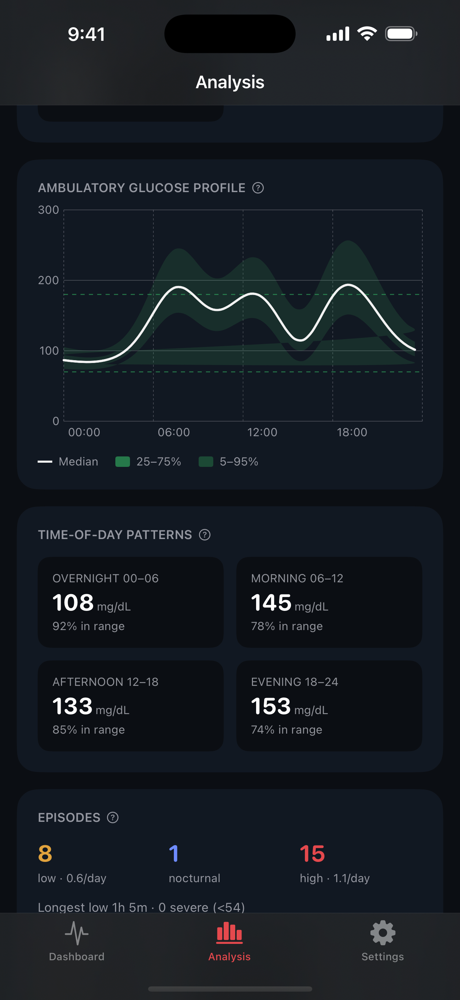 | 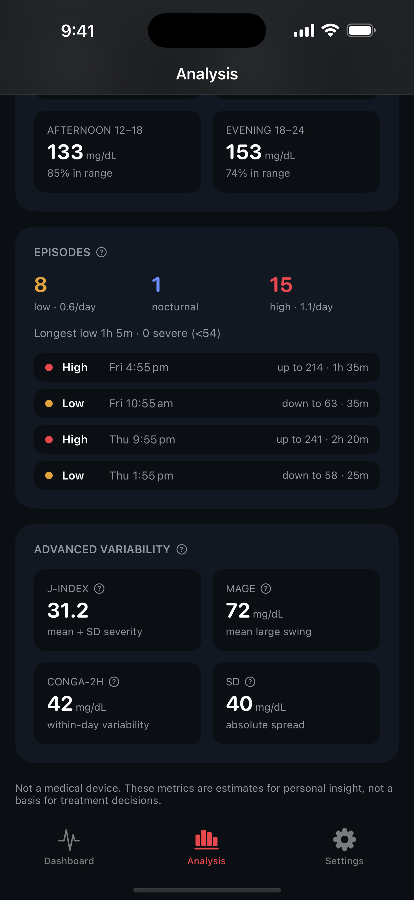 | 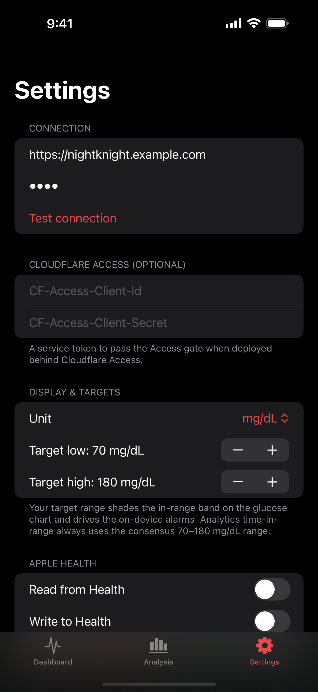 |

### Web UI

| Dashboard | Statistical Analysis |
|---|---|
| 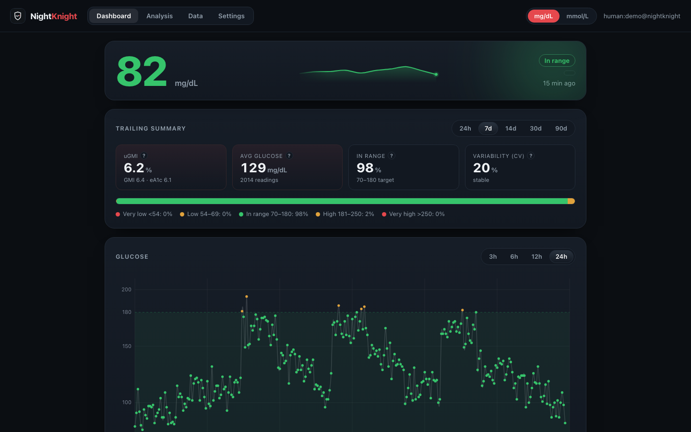 | 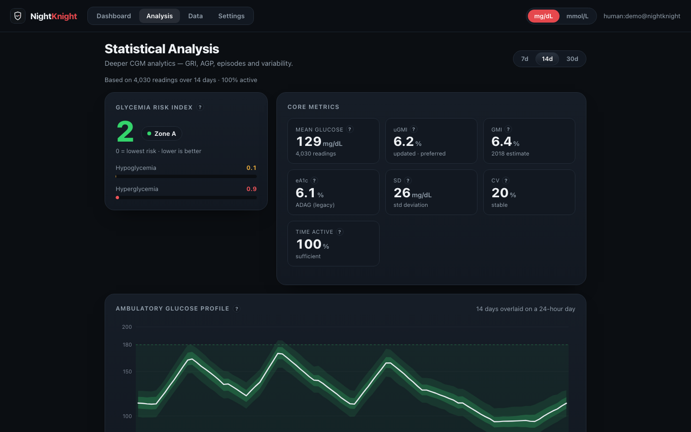 |

### Apple Watch

| Series 11 — mg/dL | Series 11 — mmol/L | Ultra 3 — mg/dL | Ultra 3 — mmol/L |
|---|---|---|---|
|  | 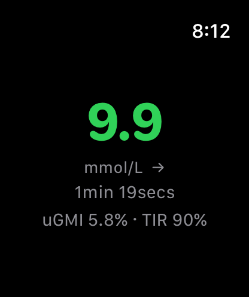 | 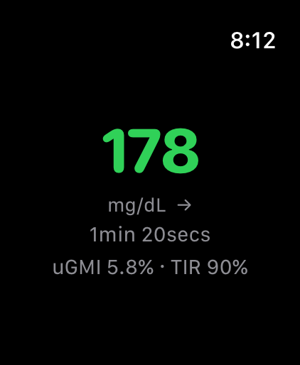 | 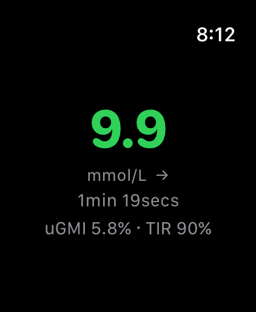 |

> Full-resolution App Store assets (iOS, iPad, Watch) are in [`marketing/appstore/screenshots/`](marketing/appstore/screenshots/).

## What it is

- **One Rust core, two runtimes.** All domain, storage, auth, and API logic lives in
  runtime-agnostic crates shared by the Cloudflare Worker and the container server,
  so behaviour is identical wherever you deploy.
- **Nightscout-compatible.** Implements the v1 and v3 APIs that uploaders (xDrip+,
  Loop, AndroidAPS, Trio) and follower apps already speak, plus a modern `v4` API for
  first-party clients.
- **mg/dL and mmol/L are both first-class.** Every reading remembers the unit it was
  entered in and carries a canonical mg/dL value; the two units mix freely in one
  stream and convert with a single, property-tested constant (18.0156).
- **Multi-user and private by default.** Every row is scoped to its owner; one
  person can never see another's data.
- **Secure by design.** Runs behind Cloudflare Access (or your own reverse proxy);
  credentials are accepted in **headers only**, never the URL query string; device
  tokens are stored only as hashes.
- **A pretty, useful dashboard.** A bespoke glucose chart (target band, threshold
  lines, colour-by-range points) plus Time-in-Range, GMI, estimated A1c and
  variability.
- **Deep, research-grounded analytics.** A dedicated *Statistical Analysis* view (web
  + iOS) with the Glycemia Risk Index, an Ambulatory Glucose Profile, hypo/hyper
  episode detection, time-of-day patterns and advanced variability (SD, J-index, MAGE,
  CONGA, MODD) — every metric explained inline and pinned to the literature
  ([docs/CGM-ANALYTICS-RESEARCH.md](docs/CGM-ANALYTICS-RESEARCH.md)), gap-tolerant, and
  unit-independent.

## Repository layout

```
service/crates/
  nightknight-core       domain model: units, entries/treatments, trend, analytics, time
  nightknight-storage    Storage trait + portable SQL shared by all backends
  nightknight-store-sql  sqlx backend (SQLite for tests + Postgres for the container)
  nightknight-store-d1   Cloudflare D1 backend (wasm32)
  nightknight-auth       Cloudflare Access / OIDC JWT verification + scope model
  nightknight-api        v1 / v3 / v4 HTTP API (transport-agnostic, shared)
  nightknight-connectors Dexcom Share + LibreLinkUp cloud connectors (pure + tested)
  nightknight-worker     Cloudflare Worker entrypoint (wasm32)
  nightknight-server     container server entrypoint (axum)
web/dist/                the web SPA (no build step — static files)
deploy/                  Dockerfile, docker-compose.yml
branding/                NightKnight app icon (hubsystem style)
docs/                    SETUP, ARCHITECTURE, API-COMPAT, TESTING,
                         openapi.yaml, STATISTICAL-ANALYSIS
```

## Quick start

See **[docs/SETUP.md](docs/SETUP.md)** for the full guide, or
**[docs/DEPLOY-WORKER.md](docs/DEPLOY-WORKER.md)** for the Cloudflare Worker
build/deploy/redeploy runbook. The short version:

- **Cloudflare:** `wrangler d1 create nightknight`, paste the id into
  `service/crates/nightknight-worker/wrangler.toml`, set the Access secrets, then
  from `service/crates/nightknight-worker` run `npx --yes wrangler@latest deploy`.
- **Container:** `cd deploy && cp .env.example .env && docker compose up -d`.

## Status

The service (both runtimes), the web app (Dashboard / Analysis / Settings) and the
native iOS app (SwiftUI tabs + Analysis view + App Intents widgets + HealthKit +
on-device alarms + Apple Watch) are built and tested. See
[docs/ARCHITECTURE.md](docs/ARCHITECTURE.md).

## Roadmap / follow-ups

Planned work, not yet implemented:

- **Historical data import.** **LibreView CSV** upload (`POST /api/v4/import/libreview`,
  with a file picker in Settings → Import history) and a **Nightscout source connector**
  (mirror another Nightscout/NightKnight instance by URL + api-secret) now ship —
  normalising into the canonical store with content dedup. Still to come: **Dexcom
  Clarity CSV** and a Nightscout `mongodump`/`treatments` path.
- **CarPlay support.** A CarPlay scene for the iOS app: current glucose + trend and a
  glanceable recent-history view, safe for in-vehicle use.
- **Exportable reports.** The deeper analytics (GRI, AGP percentile bands, time-of-day
  patterns, hypo/hyper event detection, advanced variability) now ship in the web and
  iOS *Statistical Analysis* views — see
  [docs/STATISTICAL-ANALYSIS.md](docs/STATISTICAL-ANALYSIS.md) and
  [docs/CGM-ANALYTICS-RESEARCH.md](docs/CGM-ANALYTICS-RESEARCH.md). Still to come: a
  printable AGP one-pager and CSV/JSON export of the computed metric set.
- **OpenAPI specification.** An OpenAPI 3.1 document for the v1/v3/v4 API is published at
  [docs/openapi.yaml](docs/openapi.yaml) (validates clean under Redocly), enabling
  generated clients, contract tests, and interactive docs. Auto-generating it from the
  Rust handlers (rather than hand-maintaining) is a possible follow-up.

## Acknowledgements

NightKnight is inspired by and indebted to **[Nightscout](https://github.com/nightscout/cgm-remote-monitor)**
(the CGM Remote Monitor project) and the wider **#WeAreNotWaiting** community.
Nightscout pioneered open, self-hosted continuous glucose monitoring and built the API
and ecosystem that this project gratefully builds on. Heartfelt thanks to its
maintainers and the many volunteers whose years of open-source work have helped so many
people with diabetes and the people who care for them.
